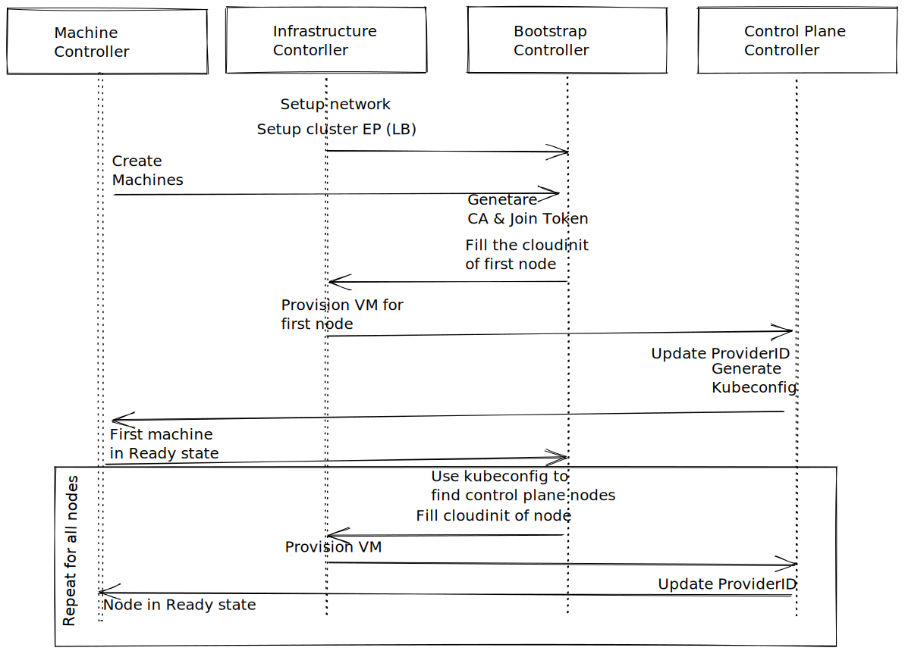

## Cluster API bootstrap provider for MicroK8s

[Cluster API](https://cluster-api.sigs.k8s.io/) provides declarative APIs to provision, upgrade, and operate Kubernetes clusters.

The [bootstrap provider controller in cluster API](https://cluster-api.sigs.k8s.io/user/concepts.html#bootstrap-provider) is responsible for initializing the control plane and worker nodes of the provisioned cluster.

This project offers a cluster API bootstrap provider controller that manages the node provision of a [MicroK8s](https://github.com/canonical/microk8s) cluster. It is expected to be used along with the respective [MicroK8s specific control plane provider](https://github.com/canonical/cluster-api-control-plane-provider-microk8s).

### Prerequisites

  * Install clusterctl following the [upstream instructions](https://cluster-api.sigs.k8s.io/user/quick-start.html#install-clusterctl)
```
curl -L https://github.com/kubernetes-sigs/cluster-api/releases/download/v1.1.3/clusterctl-linux-amd64 -o clusterctl
```

  * Install a bootstrap Kubernetes cluster. To use MicroK8s as a bootstrap cluster:
```
sudo snap install microk8s --classic
sudo microk8s.config  > ~/.kube/config
sudo microk8s enable dns
```

### Installation

To to configure clusterctl with the two MicroK8s providers edit `~/.cluster-api/clusterctl.yaml`
and add the following:
```
providers:
  - name: "microk8s"
    url: "https://github.com/canonical/cluster-api-bootstrap-provider-microk8s/releases/latest/bootstrap-components.yaml"
    type: "BootstrapProvider"
  - name: "microk8s"
    url: "https://github.com/canonical/cluster-api-control-plane-provider-microk8s/releases/latest/control-plane-components.yaml"
    type: "ControlPlaneProvider"
```

You will now be able now to initialize clusterctl with the MicroK8s providers: 

```
clusterctl init --bootstrap microk8s --control-plane microk8s -i <infra-provider-of-choice>
```

Alternatively, you can build the providers manually as described in the following section.


### Building from source

  * Install the cluster provider of your choice. Have a look at the [cluster API book](https://cluster-api.sigs.k8s.io/user/quick-start.html#initialization-for-common-providers) for your options at this step. You should deploy only the infrastructure controller leaving the bootstrap and control plane ones empty. For example assuming we want to provision a MicroK8s cluster on OpenStack:
```
clusterctl init --infrastructure openstack --bootstrap "-" --control-plane "-"
``` 

  * Clone the two cluster API MicroK8s specific repositories and start the controllers on two separate terminals:
```
cd $GOPATH/src/github.com/canonical/cluster-api-bootstrap-provider-microk8s/ 
make install
make run
``` 
And:
```
cd $GOPATH/src/github.com/canonical/cluster-api-control-plane-provider-microk8s/ 
make install
make run
``` 

### Usage

Aas soon as the bootstrap and control-plane controllers are up and running you can apply the cluster manifests describing the desired specs of the cluster you want to provision. Each machine is associated with a MicroK8sConfig through which you can set the cluster's properties. Please review  the available options in [the respective definitions file](./apis/v1beta1/microk8sconfig_types.go). You may also find useful the example manifests found under the [examples](./examples/) directory. Note that the configuration structure followed is similar to the the one of kubeadm, in the MicroK8sConfig you will find a CLusterConfiguration and an InitConfiguration sections. When targeting a specific infrastructure you should be aware of which ports are used by MicroK8s and allow them in the network security groups on your deployment.

Deployment manifests we use to validate every release:

  - [openstack](./examples/openstack-capi-quickstart.yaml)


## Development

The two MicroK8s CAPI providers, the bootstrap and control plane, serve distinct purposes:

#### The bootstrap provider

  Produce the cloudinit file for all node types: the first cluster node, the control plane nodes and the worker nodes. The cloudinit file is encoded as a secret linked to each machine. This way the infrastructure provider can proceed with the instantiation of the machine.
  
  The most important of the three cloudinit files is the one of the cluster's first node. Its assembly requires the bootstrap provider to have already a join token and a CA. The join token is the one used by other nodes to join the cluster and the CA is used by all cluster nodes and to also produce the admin's kubeconfig file.

#### The control plane provider

  * Ensure the Provider ID is set on each node. MicroK8s out of the box does not set the provider ID on any of the nodes. The control plane provider makes sure the ID is set as soon as a node is ready. The infrastructure provider sets the provider ID on each provisioned machine, the control plane provider updates the cluster nodes after matching each one of them to the respective machine. The machine to node matching is done based on their IPs.

  * Produce the kubeconfig file of the provisioned cluster. To produce the kubeconfig file the controller needs to know the control plane endpoint and the CA used. The control plane endpoint is usually provided by the load balancer of the infrastructure used. The CA is generated by the bootstrap provider when the first node of the infrastructure is instantiated. The authentication method used in the kubeconfig is x509. The CA is used to sign a certificate that has "admin" as its common name, therefore mapped to the admin user.
    

##### Deployment of components


##### Interactions between controllers 


