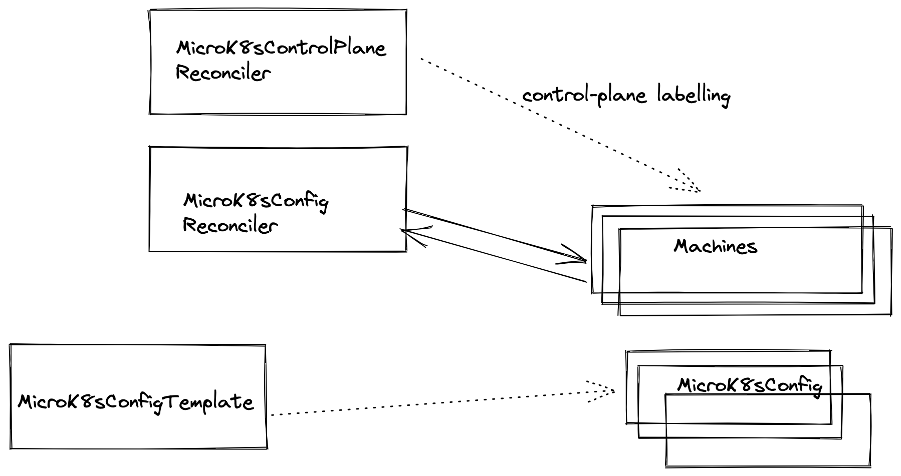

## cluster-api-bootstrap-provider-microk8s




## Local (hacking) Development

1. Run a kind create cluster with the following config object

```
kind: Cluster
apiVersion: kind.x-k8s.io/v1beta1
nodes:
- role: control-plane
  extraMounts:
    - hostPath: /var/run/docker.sock
      containerPath: /var/run/docker.sock
```

2. Install CAPI `clusterctl --infrastructure docker`

3. Disable the kubeadm deployments or delete
4. Delete the kubeadmin mutating validating + admission webhook
